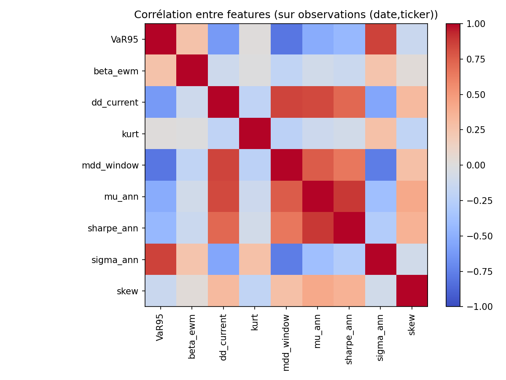
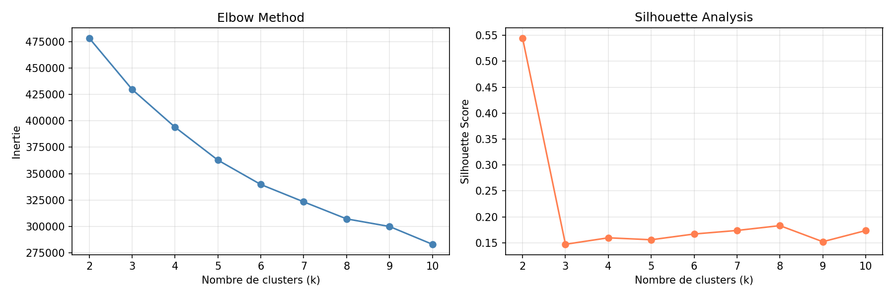
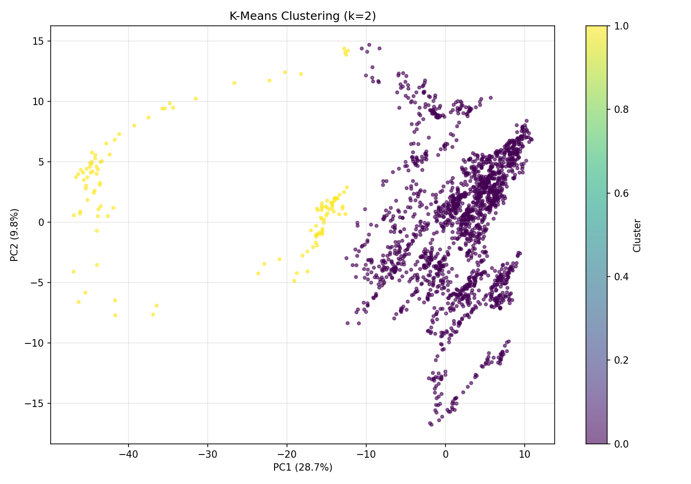
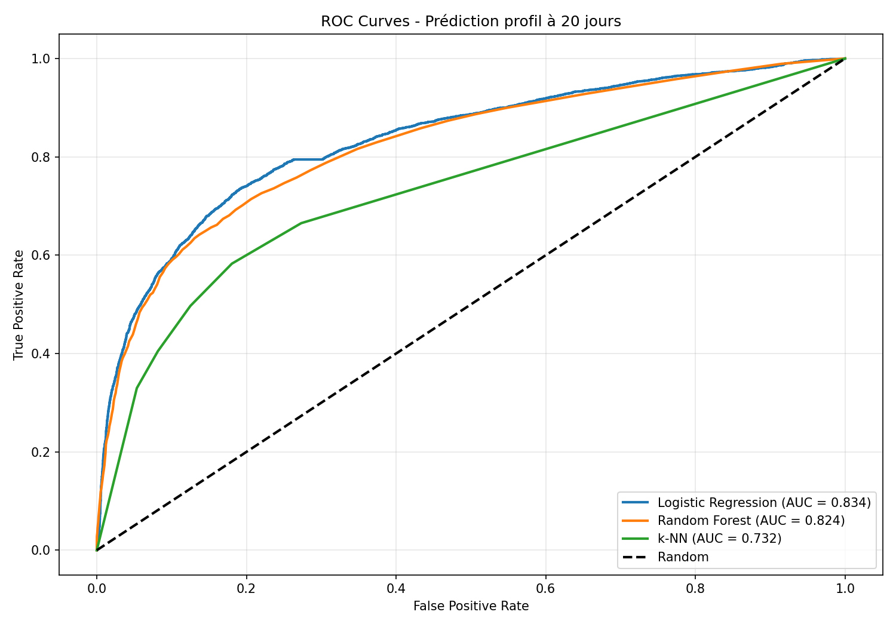
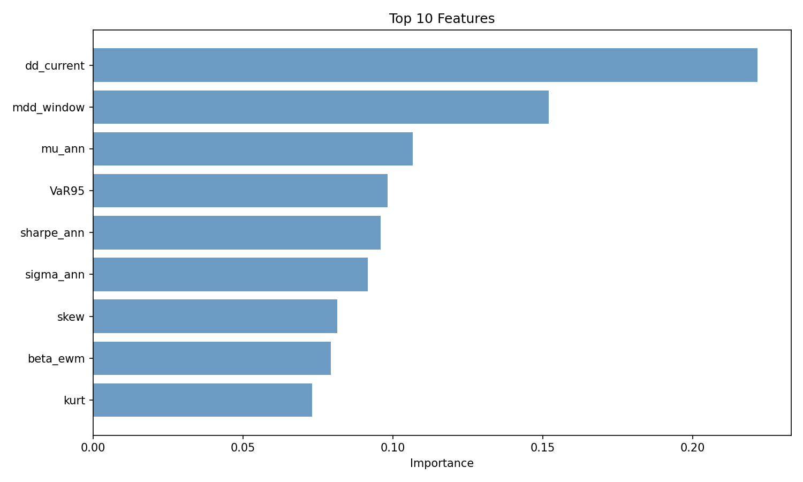

# Projet ML Finance – Clustering & Classification Supervisée (Actions CAC 40)

Nous avons choisi comme projet un jeu de données réel issu du domaine financier : nous travaillons sur **37 actions du CAC 40** sur une période de plusieurs années (2018-2025, prix journaliers).

L'objectif est de mettre en œuvre, sur ces données, les méthodes de clustering non supervisé et de classification supervisée vues en cours, en suivant la logique suivante :

---

## 1. Préparation des données

### Source et période
- Téléchargement des prix de clôture journaliers via **Yahoo Finance** (`yfinance`)
- Période : **2018-01-01 à 2025-10-07**
- **37 actions** du CAC 40 sélectionnées

### Features financières (fenêtre glissante 60 jours)
Construction de **9 variables** classiques en finance :
- **Rendement annualisé** (`mu_ann`) : performance moyenne
- **Volatilité annualisée** (`sigma_ann`) : risque
- **Sharpe ratio annualisé** (`sharpe_ann`) : rendement ajusté du risque
- **VaR 95%** (`VaR95`) : Value-at-Risk (risque extrême)
- **Drawdown courant** (`dd_current`) : perte instantanée
- **Max Drawdown** (`mdd_window`) : perte maximale sur 60 jours
- **Skewness** (`skew`) : asymétrie de la distribution
- **Kurtosis** (`kurt`) : queues épaisses (événements extrêmes)
- **Beta** (`beta_ewm`) : sensibilité au marché (leave-one-out)

### Preprocessing
- **Standardisation** (z-score) : moyenne = 0, écart-type = 1
- **Format long** : (date, ticker) × 9 features → **67 585 observations**
- Suppression des valeurs manquantes

## 1.5 Analyse Exploratoire des Données (EDA)

Avant le clustering, une analyse exploratoire a été menée pour valider la qualité des features :

- **Distributions** : Visualisation des histogrammes et boxplots de chaque variable
- **Corrélations** : Matrice de corrélation entre les 9 features (aucune corrélation > 0.9)
- **Outliers** : Détection via z-scores combinés (quelques observations extrêmes identifiées)

**Conclusion** : Les 9 features sont complémentaires et non redondantes, toutes conservées pour l'analyse.
---

## 2. Partie non supervisée (Clustering)

### Objectif
Identifier des **profils de risque naturels** parmi les actions du CAC 40 sans labels préexistants.

### Détermination du nombre optimal de clusters

*Figure 1 : Analyse du nombre optimal de clusters via Elbow Method et Silhouette Score*

**Analyse** :
- **Elbow Method** : Décroissance continue sans coude net
- **Silhouette Score** : Maximum à **k=2** (score = 0.55)
- Chute brutale pour k≥3 (score < 0.2)

**Conclusion** : **k=2 optimal** avec une structure binaire claire.

---

### K-Means Clustering (k=2)

*Figure 2 : Visualisation PCA 2D du clustering K-Means (k=2)*

**Observations** :
- **PC1 + PC2** : 38.5% de variance expliquée (normal pour données financières multidimensionnelles)
- **Cluster 0 (jaune, 21%)** : Groupe compact et isolé, profil atypique/volatil
- **Cluster 1 (violet, 79%)** : Groupe dominant et étendu, comportement standard du marché

**Interprétation financière** :

| Cluster | Proportion | Profil                                      |
|---------|-----------|---------------------------------------------|
| 0       | 21%       | Actions atypiques (forte volatilité, événements exceptionnels, ou très défensives) |
| 1       | 79%       | Actions standard (beta ~1, volatilité modérée, comportement de marché) |

**Séparation nette** confirmée par le silhouette score élevé (0.55), indiquant une dichotomie claire dans les comportements.

**Note** : Le clustering est effectué en **333 dimensions** (37 tickers × 9 features). La visualisation PCA 2D est une simplification pour l'interprétation.

---

## 3. Partie supervisée (Classification)

### Objectif
**Prédire le profil de risque futur** d'une action avec un horizon de **20 jours de bourse** (~1 mois).

### Construction de la target
- **Features(t)** : 9 variables financières au temps t
- **Target(t+20)** : Cluster d'appartenance 20 jours plus tard
- Permet d'anticiper les transitions de comportement avant qu'elles ne se produisent

### Split temporel
- **Train** : 75% des données (2018 → Oct 2023) → 50 155 observations
- **Test** : 25% des données (Oct 2023 → 2025) → 16 730 observations
- Respect strict de la chronologie (pas de look-ahead bias)

---

### Modèles testés et performance

Trois algorithmes de classification ont été comparés :

1. **Logistic Regression** : Baseline linéaire simple et interprétable
2. **Random Forest** : Ensemble robuste (100 arbres)
3. **k-NN** : Méthode non paramétrique (k=5)

#### Résultats (Holdout 75/25)

| Modèle               | Accuracy | F1-Score | AUC   |
|---------------------|----------|----------|-------|
| Logistic Regression | 79.47%   | 80.47%   | **0.834** |
| **Random Forest**   | **83.61%** | **82.11%** | 0.824 |
| k-NN                | 78.92%   | 78.62%   | 0.732 |

*Figure 3 : Courbes ROC comparatives - Prédiction du profil à 20 jours*

**Analyse** :
- **Logistic Regression** : Meilleur AUC (0.834), excellente discrimination
- **Random Forest** : Meilleure accuracy globale (83.61%)
- **k-NN** : Performances inférieures, moins adapté

---

#### Validation croisée temporelle (5 folds)

Pour valider la robustesse des modèles sur différentes périodes de marché :

| Modèle               | Accuracy         | F1-Score         | AUC              |
|---------------------|------------------|------------------|------------------|
| Logistic Regression | 81.17% ± 2.28%   | 82.17% ± 2.13%   | 84.96% ± 2.44%   |
| **Random Forest**   | **85.05% ± 1.95%** | **83.49% ± 2.29%** | 82.96% ± 2.85%   |
| k-NN                | 81.40% ± 2.16%   | 80.82% ± 2.34%   | 75.60% ± 3.42%   |

**Enseignement clé** : La cross-validation révèle que **Random Forest** est :
- ✅ Plus performant (+3.9% accuracy vs Logistic)
- ✅ Plus stable (écart-type le plus faible : ±1.95%)
- ✅ Robuste sur différents régimes de marché

---

### Feature Importance (Random Forest)

*Figure 4 : Top 10 des features les plus importantes pour la prédiction*

**Variables les plus prédictives** :

| Rang | Feature       | Importance | Interprétation                    |
|------|--------------|-----------|-----------------------------------|
| 1    | `dd_current` | ~0.21     | Drawdown courant (perte instantanée) |
| 2    | `mdd_window` | ~0.15     | Max drawdown sur 60 jours         |
| 3    | `mu_ann`     | ~0.11     | Rendement annualisé               |
| 4    | `VaR95`      | ~0.10     | Value-at-Risk 95%                 |
| 5    | `sharpe_ann` | ~0.09     | Ratio de Sharpe                   |

**Insight majeur** : Les **mesures de pertes passées** (drawdowns) sont les meilleurs indicateurs du profil de risque futur. Les actions subissant des pertes importantes tendent à basculer vers le profil volatil (Cluster 0).

---

### Conclusion supervisée

**Random Forest = modèle optimal** pour prédire les profils de risque à 20 jours :
- ✅ **85% accuracy** sur cross-validation
- ✅ **Stable** : écart-type de ±1.95%
- ✅ **Robuste** : performances constantes sur 5 périodes temporelles distinctes

**Application pratique** : 
- Anticiper les actions qui basculeront vers un profil volatil 1 mois à l'avance
- Ajuster l'allocation de portefeuille de manière proactive
- Réduire l'exposition au risque avant les transitions de comportement

---

## 4. Résultats et enseignements

### Non supervisé : Structure binaire du marché
- **K-Means avec k=2** révèle une dichotomie claire (silhouette = 0.55)
- **79/21 répartition** : comportement majoritaire standard vs profil atypique
- Validation robuste via **Elbow Method** et **Silhouette Analysis**

### Supervisé : Prédiction performante
- **85% accuracy** pour prédire le profil à 20 jours (Random Forest)
- **Drawdowns** = variables les plus prédictives (importance 0.21)
- **Cross-validation temporelle** essentielle : a révélé la supériorité de Random Forest

### Comparaison Holdout vs Cross-Validation

| Aspect                 | Holdout (Phase 2)      | Cross-Validation (Phase 3) |
|------------------------|------------------------|----------------------------|
| **Évaluation**         | 1 seul split           | 5 splits temporels         |
| **Random Forest**      | 83.61% accuracy        | 85.05% ± 1.95%             |
| **Logistic**           | AUC = 0.834 (meilleur) | AUC = 0.850 ± 0.024        |
| **Conclusion initiale**| Résultats serrés       | Random Forest nettement supérieur |

**Enseignement** : Un seul split peut être trompeur. La cross-validation temporelle est indispensable pour valider la robustesse en finance.

---

## 5. Livrables

### Code et analyses
- **Notebook Python complet** avec :
  - EDA des features financières
  - Détermination du k optimal (Elbow + Silhouette)
  - K-Means clustering + visualisation PCA
  - Construction de la target supervisée (horizon 20 jours)
  - Entraînement et évaluation de 3 modèles
  - Cross-validation temporelle (5 folds)
  - Feature importance et ROC curves

### Visualisations produites
- ✅ Elbow Method & Silhouette Analysis (`choose_k.png`)
- ✅ K-Means clustering PCA 2D (`kmeans_clustering.png`)
- ✅ ROC curves comparatives (`ROC_Curves.png`)
- ✅ Feature importance (`topfeatures.png`)

### Vidéo explicative (5–8 min)
1. **Introduction** : Présentation du jeu de données (37 actions CAC 40, 9 features, 67k observations)
2. **Non supervisé** : K-Means, choix de k=2, interprétation des profils (défensif vs volatil)
3. **Supervisé** : Prédiction à 20 jours, comparaison modèles, validation croisée
4. **Conclusion** : Lien avec les notions du cours et application pratique en gestion de portefeuille

---

## 6. Conclusion

Ce projet illustre une **démarche complète de Machine Learning en finance** :

### Méthodes du cours appliquées
- **Non supervisé** : K-Means, choix du nombre de clusters (Elbow, Silhouette)
- **Supervisé** : Régression Logistique, Random Forest, k-NN
- **Validation** : Split temporel, Cross-validation temporelle (Time Series Split)

### Apports méthodologiques
- ✅ Importance de la **validation temporelle** en finance (pas de CV aléatoire)
- ✅ Comparaison **Holdout vs CV** révèle la robustesse réelle des modèles
- ✅ **Feature engineering** financier (drawdowns, VaR, beta leave-one-out)
- ✅ Gestion du **déséquilibre de classes** (79/21) via `class_weight='balanced'`

### Résultat pratique
Un modèle Random Forest capable de **prédire les profils de risque à 20 jours** avec **85% de précision**, exploitable pour :
- Anticiper les transitions de comportement
- Ajuster dynamiquement l'allocation de portefeuille
- Réduire l'exposition au risque de manière proactive

---

**Note** : Le projet s'appuie sur des données réelles (Yahoo Finance) et une démarche rigoureuse validée par cross-validation temporelle, respectant les contraintes spécifiques de la finance quantitative.